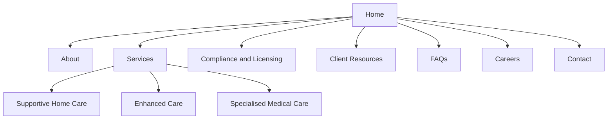
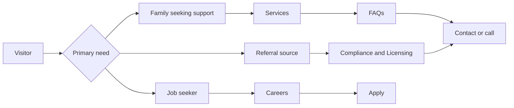

# Tuza Health, LLC Research Report

## Executive summary

Tuza Health, LLC is a Kansas home-health-related organisation with a verified public presence in Johnson County, Kansas. The strongest primary evidence is Johnson County’s official Community Developmental Disabilities Organization provider listings, where Tuza Health, LLC appears for **Supportive Home Care**, **Specialized Medical Care**, and **Enhanced Care Services**. On the current county pages, Tuza is shown as **accepting new referrals** for supportive home care, specialized medical care, and enhanced care, with an Overland Park address and a county-facing contact, David Mpoza. citeturn5search0turn5search1turn5search2

The company’s public data is materially inconsistent across sources. Johnson County lists **7500 College Boulevard, Suite 560, Overland Park, KS 66210** and **913-562-4326**. By contrast, NPPES-derived directory pages for NPI **1376248864** list **6300 W 138th Ter Apt 727, Overland Park, KS 66223-7906**, **336-847-5273**, and **Evet Mutezinka** as the authorised official/managing director. That discrepancy means the future website **must not publish address, phone, leadership or licensing claims until the business confirms a single canonical set of facts**. citeturn33search1turn29search6turn34search0turn34search1turn34search2

I did **not** find a verified standalone Tuza Health website, a verified public company email address, or an accessible Tuza-specific Kansas home health licence number in the sources reviewed. Kansas does require licensure for home health agencies, and KDHE identifies licensure tracks including **Non-Medical Supportive Care Services** and **Skilled Services**, but Tuza’s own licence number did not surface in the accessible official pages reviewed. This creates a trust gap that the new website should explicitly solve with a **Compliance & Licensing** page, clearly verified contact details, and downloadable policy documents. citeturn8search0turn8search4turn8search10turn8search18turn12search0turn34search0

From a website strategy perspective, the priority is not visual flourish; it is **credibility reconstruction**. The site should behave as a verification hub first and a marketing brochure second: clear service explanations, exact service area, licensing identifiers, leadership/staff profiles, referral pathways, FAQs, privacy notices, and a tightly scoped contact workflow. Against peer sites in the same region, the biggest opportunity is to combine the trust signals of larger providers with a simpler, more local and family-readable experience. citeturn30view0turn30view1turn31search1turn36search0turn26search0

## Verified company profile

The table below distinguishes between what can be verified now and what remains unspecified.

| Field | Current finding | Evidence and confidence |
|---|---|---|
| Legal name | **Tuza Health, LLC** | Listed on Johnson County provider pages and in NPPES-derived directory records. **High confidence.** citeturn34search0turn34search1turn34search2turn33search1 |
| DBA(s) | **Unspecified** | NPPES-derived directory states “no other names available”. No alternate operating name surfaced in reviewed sources. **Moderate confidence.** citeturn29search6 |
| Address(es) | **Primary public program address:** 7500 College Boulevard, Suite 560, Overland Park, KS 66210. **Alternate NPI-derived location/mailing address:** 6300 W 138th Ter Apt 727, Overland Park, KS 66223-7906. | Official county pages and NPPES-derived directory conflict. **High confidence that a discrepancy exists; low confidence on which address should be published.** citeturn34search0turn34search1turn34search2turn29search6 |
| Phone | **County listing:** 913-562-4326. **NPI-derived listing:** 336-847-5273. | Conflict between official county provider listings and NPPES-derived directory. **High confidence that a discrepancy exists; low confidence on canonical number.** citeturn34search0turn34search1turn34search2turn29search6 |
| Email | **Unspecified** | No verified Tuza company email was located in official or high-confidence reviewed sources. **Low confidence.** citeturn12search0turn34search0 |
| Services offered | **Supportive Home Care**, **Specialized Medical Care**, **Enhanced Care Services** within the Johnson County CDDO provider ecosystem. | Tuza appears on the official county provider lists for all three service lines. County definitions describe supportive home care as one-on-one assistance with daily living and adaptive skills; specialized medical care as long-term RN/LPN support for medically fragile and technology-dependent people; and enhanced care as supervision or physical assistance with tasks such as toileting, transferring, mobility and medication reminders. **High confidence.** citeturn34search0turn34search1turn34search2 |
| Licences / credentials | **NPI:** 1376248864. **Taxonomy:** 251E00000X Home Health. **Kansas home health licence number:** unspecified in reviewed accessible sources. | NPPES-derived directory shows active organisation NPI and Home Health taxonomy. KDHE states home health agencies are licensed in Kansas and identifies licensure types including Non-Medical Supportive Care Services and Skilled Services. A Tuza-specific licence number was not located in the reviewed official pages. **High confidence on NPI; low confidence on state licence detail.** citeturn29search6turn8search0turn8search4turn8search10turn8search18 |
| Ownership / leadership | **County-facing contact:** David Mpoza. **NPI authorised official / managing director:** Evet Mutezinka. **Ownership:** unspecified. | Public records show at least two named individuals attached to the company, but accessible sources do not establish equity ownership. **Moderate confidence on named contacts; low confidence on ownership.** citeturn34search0turn34search1turn34search2turn29search6 |
| Years in operation | **Documented public operation since 3 April 2023**; roughly **3 years** as of 30 June 2026. **Company formation date:** unspecified. | Based on NPI enumeration date, not legal formation date. **Moderate confidence.** citeturn29search6 |
| Service area | **Johnson County, Kansas** is the clearly verified public-service geography. Broader area is unspecified. | Tuza appears on Johnson County CDDO provider pages. County pages are the strongest evidence of current program participation there. **High confidence for Johnson County; low confidence beyond it.** citeturn34search0turn34search1turn34search2 |
| Referral status | **Accepting new referrals** on currently reviewed Johnson County pages for Supportive Home Care, Specialized Medical Care and Enhanced Care Services. | Time-sensitive information from official county pages. **High confidence as of 30 June 2026.** citeturn34search0turn34search1turn34search2 |
| Regulatory / public records | Official Johnson County provider listings, NPI public record via NPPES-derived directories, Kansas licensure framework pages. | These are the material public records available in the current review. citeturn34search0turn34search1turn34search2turn29search6turn8search0turn8search18 |

Two conclusions matter for the website build. First, **entity-level legitimacy is supported**: Tuza exists as a named LLC in county provider listings and as an active NPI-bearing organisation. Second, **marketing-level facts are not yet stable enough to publish without confirmation**: the address, phone and operational leadership differ by source. That makes a verification sprint the most important pre-build task. citeturn34search0turn34search1turn34search2turn29search6

## Public footprint and source credibility

The discoverable footprint is narrow. In the current review, the highest-confidence mentions are **official Johnson County government pages**. Secondary mentions are **NPPES-derived directories** and generic commercial healthcare listings. I did **not** locate substantive news coverage, press releases, or a clearly verified official Tuza Health website in the reviewed results. That absence is strategically important: the future site should assume it is creating Tuza’s first strong digital identity rather than replacing a mature one. citeturn12search0turn12search1turn34search0turn34search1turn34search2

For reliability, the practical hierarchy is straightforward. Government program listings are strongest because they show current county-recognised service participation. NPI/NPPES-derived pages are useful for identity and taxonomy but are still secondary wrappers around government data. Commercial directories add very little incremental authority unless they reveal something not found elsewhere. citeturn34search0turn34search1turn34search2turn29search6turn29search5turn33search8

### Source table

**Reliability scale:** **A** = official government or official provider website; **B** = government-derived registry or reputable sector association; **C** = commercial directory/aggregator; **D** = weak or user-generated.

| Source | URL | Type | Date observed | Reliability | Key facts captured |
|---|---|---|---|---|---|
| Johnson County CDDO Supportive Home Care | `https://www.jocogov.org/department/community-developmental-disabilities-organization/service-providers/supportive-home-care` | Government page | 30 Jun 2026 | **A** | Tuza Health, LLC listed at 7500 College Blvd, Suite 560, Overland Park; David Mpoza; 913-562-4326; accepting new referrals for Supportive Home Care. citeturn34search0 |
| Johnson County CDDO Specialized Medical Care | `https://www.jocogov.org/department/community-developmental-disabilities-organization/service-providers/specialized-medical-care` | Government page | 30 Jun 2026 | **A** | Tuza listed as accepting new referrals for Specialized Medical Care; county defines service as long-term RN/LPN support for medically fragile, technology-dependent individuals. citeturn34search1 |
| Johnson County CDDO Enhanced Care Services | `https://www.jocogov.org/department/community-developmental-disabilities-organization/service-providers/enhanced-care-services` | Government page | 30 Jun 2026 | **A** | Tuza listed as accepting new referrals for Enhanced Care Services; county defines service as supervision/physical assistance with mobility, toileting, transferring and medication reminders. citeturn34search2 |
| KDHE Home Health Agencies overview | `https://www.kdhe.ks.gov/582/Home-Health-Agencies` | Government page | 30 Jun 2026 | **A** | Kansas regulates home health agency licensure and identifies service/licensure categories relevant to interpreting Tuza’s business type. citeturn8search0 |
| KDHE Non-Medical Supportive Care Services | `https://www.kdhe.ks.gov/2172/Non-Medical-Supportive-Care-Services` | Government page | 30 Jun 2026 | **A** | Kansas describes non-medical supportive care licensure and common service scope such as ADL support and medication reminders. citeturn8search4 |
| KDHE Skilled Services | `https://www.kdhe.ks.gov/2173/Skilled-Services` | Government page | 30 Jun 2026 | **A** | Kansas states Skilled Services licensure includes skilled services, HCBS, and non-medical supportive care services. citeturn8search10 |
| NPINo Tuza profile | `https://npino.com/home-health/1376248864-tuza-health%2C-llc/` | NPPES-derived directory | 30 Jun 2026 | **B** | NPI 1376248864; Home Health taxonomy; 6300 W 138th Ter Apt 727; 336-847-5273; authorised official Evet Mutezinka; no other names listed. citeturn29search6 |
| Labdraw Tuza profile | `https://labdraw.com/reviews/1376248864` | Commercial directory | 30 Jun 2026 | **C** | Repeats Home Health taxonomy, 6300 W 138th Ter Apt 727, 336 phone, and 2023 modification date. citeturn29search5 |
| ProviderWire Overland Park directory | `https://providerwire.com/home-health-agency/kansas/overland-park` | Commercial directory | 30 Jun 2026 | **C** | Confirms Tuza appears among Overland Park home health agencies. Little additional detail beyond category presence. citeturn33search8 |
| NPIProfile similar providers page | `https://npiprofile.com/npi/1629468483/similar` | Commercial directory | 30 Jun 2026 | **C** | Places Tuza among Johnson County home health peers and repeats the 6300 W 138th Ter / 336 number data. citeturn33search6 |

The practical reading of this footprint is that Tuza is **visible enough to be legitimate, but not visible enough to be self-explanatory**. A prospective client searching today would find a county listing and a handful of directories, but no strong first-party story, no obvious compliance page, and no easy way to reconcile conflicting public details. That is precisely the gap the website should close. citeturn34search0turn29search6turn33search8

## Regional peer analysis

For pure service overlap, Tuza’s closest county-listed peers include providers such as PEAK Healthcare Solutions, Simply Better Home Health, Destiny Home Health, We Care Home Health Services, TAV Home Health and Maxim Healthcare Services. For website benchmarking, I prioritised five providers in the same region with accessible official sites and useful design/content patterns. citeturn34search0turn34search1turn34search2

| Provider | Regional relevance | Services highlighted on site | Site structure | Key messaging | Notable features | What Tuza should learn |
|---|---|---|---|---|---|---|
| **BrightStar Care Olathe / Overland Park** | Serves Overland Park, Mission, Olathe, Gardner, Stilwell and nearby cities. citeturn30view0 | In-home care, skilled nursing, memory care, medical staffing, business partnerships. citeturn30view0 | Large, hierarchical navigation: Services, Who We Serve, Careers, About, Resources, Contact. citeturn30view0 | “A higher standard”; broad but quality-led. citeturn30view0 | 24/7 contact, reviews, awards, Joint Commission quality signal, careers, city coverage. citeturn30view0 | Tuza should emulate the **trust stack**: service clarity, service-area proof, award/compliance badges, and visible phone-first conversion. |
| **Maxim Healthcare Kansas City Regional Office** | Overland Park office with explicit county coverage list including Johnson, Leavenworth, Wyandotte and others. citeturn30view1 | Home health, private duty nursing, personal caregiving, school nursing, military/federal support, case coordination. citeturn30view1 | Enterprise-grade site with Services, Locations, Resources, About, Contact, Careers, Patient Portal, referral flows. citeturn30view1 | “Elevating care to empower lives”; highly operational and referral-friendly. citeturn30view1 | Multilingual options, privacy/patient notices, referral source support, service-area detail, jobs. citeturn30view1 | Tuza should borrow the **compliance + conversion** pattern: visible privacy, referral CTAs, and service-area specificity. |
| **P.E.A.K. Healthcare Solutions** | Overland Park provider listed by Johnson County; local office and contact details published on site. citeturn34search0turn31search1 | In-home nursing care, non-medical home care, staffing; Medicaid, private insurance and private pay are mentioned on the non-medical page. citeturn31search1turn31search2 | Compact nav: Home, Services, About, Jobs, Apply, Register, Log In. citeturn31search1turn31search10 | Practical, staffing-oriented, direct-response tone. citeturn31search1turn31search2 | Application flow, employee login, detailed non-medical service list, explicit contact info. citeturn31search1turn31search3turn31search8 | Tuza should adopt PEAK’s **simple, decisive conversion path**, but with cleaner copy, clearer client/family orientation, and better proof. |
| **Simply Better Home Health** | Johnson County-listed provider in Mission/Overland Park area; site lists phone, email and address. citeturn34search0turn36search0 | Compassionate home care, skilled nursing to personal care, general support. citeturn36search0 | Essentially a one-page or near-one-page brochure with cards for careers, service areas, FAQs, news and enquiries. citeturn36search0 | “Independence Is… Simply Better”; warm and generic. citeturn36search0 | Basic contact info, enquiry form, cookies notice, service teaser cards. citeturn36search0 | Tuza can outperform this by keeping the simplicity but adding **far stronger credibility signals, clearer service pages, and less templated copy**. |
| **TAV Home Health** | Johnson County-listed supportive/enhanced care provider with Overland Park office. citeturn34search0turn34search2turn26search2 | Skilled nursing, physical therapy, occupational therapy, speech therapy, medical social services, personal care/daily living assistance. citeturn26search2turn26search4turn26search14turn26search16turn26search10 | Modern SEO service-page structure with local landing pages, About, Services, Contact and “Why Choose Us”. citeturn26search0turn26search2turn26search8 | Local, compassionate, patient-centred, independence-focused. citeturn26search0turn26search2 | Strong local landing pages, “Request Care” CTA, office details, service-specific pages. citeturn26search2turn26search10turn26search14 | Tuza should borrow TAV’s **local SEO model** and service-page architecture, but pair it with a better compliance page and more explicit public verification. |

Across this peer set, the strongest recurring patterns are consistent. Better-performing sites clearly state **who they serve**, **what services they provide**, **where they operate**, **how to contact them immediately**, and **why they can be trusted**. The weakest sites are those that speak in generic “compassionate care” language without proof, staff identities, or operational detail. Tuza should aim for the former and explicitly avoid the latter. citeturn30view0turn30view1turn31search1turn36search0turn26search0

## Website strategy and information architecture

Because Tuza’s public footprint is currently sparse and inconsistent, the recommended site architecture should be **trust-led, referral-friendly and locally legible**. The ideal visitor should be able to confirm, within one screen, that Tuza is a real provider in Johnson County, what services it offers, how to contact it, and what regulatory identifiers it can substantiate. The site should therefore foreground **services**, **contact**, and **compliance/licensing** rather than hiding proof points behind an About page. citeturn34search0turn34search1turn34search2turn29search6

### Recommended site map

### Recommended page flow

### Page-by-page content model

| Page | Purpose | Required content | Strong proof elements | Primary CTA |
|---|---|---|---|---|
| **Home** | Establish trust quickly and route users to the right service | Short service summary, service area, contact strip, referral status, high-level trust signals, featured FAQs | Verified address and phone, NPI, county-program participation, leadership summary, testimonial block only if genuinely sourced | **Call now** / **Request a call back** |
| **About** | Explain who Tuza is and why families should trust it | Company story, mission, service philosophy, leadership/staff profiles, service values, care approach | Named leadership, team credentials, office photos, years documented in operation | **Meet our team** / **Speak to our care team** |
| **Services** | Help users self-identify the correct service | Intro page plus three detail pages: Supportive Home Care, Enhanced Care, Specialised Medical Care | County-aligned service definitions, eligibility/funding note where relevant, practical examples of support | **Discuss your needs** |
| **Contact** | Convert enquiries without friction | Canonical phone, address, office hours, form, map, “what to expect after you contact us” | Human response-time commitment, alternate contact method, map plus text directions | **Call** / **Send enquiry** |
| **FAQs** | Reduce hesitation and operational confusion | Funding/referrals, service area, hours, first visit, paperwork, safety, staffing, privacy | Clear, specific answers; links to resources and compliance docs | **Still need help? Contact us** |
| **Careers** | Attract carers and nurses without cluttering client journeys | Open roles, minimum qualifications, culture, benefits, simple application route | Staff testimonials, licensure expectations, equal opportunity notice | **Apply now** |
| **Client Resources** | Support intake and family decision-making | Intake checklist, service guide PDFs, what-to-expect guide, privacy notice, rights/responsibilities, referral documents | Download dates and file sizes; plain-language summaries | **Download resources** |
| **Compliance & Licensing** | Close the trust gap created by inconsistent public data | Legal name, NPI, state licence number once verified, counties served, policies, privacy notice, complaint/reporting contacts, accessibility statement | Scanned or transcribed verification items, dates last reviewed, policy download links | **View documents** |

The service content should mirror the county’s language closely enough to remain accurate, but it should be rewritten into clear family-centred English. For example, the county’s official definitions can anchor the service pages, while the website translates them into “what this looks like at home” sections, typical use-cases, and referral steps. Because county pages also note that approved funding may be required, the Tuza service pages should include a plainly worded funding/eligibility notice instead of leaving families to guess. citeturn34search0turn34search1turn34search2

## UI component system for shadcn Lyra Sky

For the **Lyra Sky** direction with **minimal or no border radii**, the visual system should feel calm, clinical and credible rather than soft and playful. Use flat planes, restrained shadows, strong spacing, and a near-square geometry: `rounded-none` as the default, with at most `rounded-sm` on a few dense interactive controls if usability testing shows it helps. The design should earn warmth through photography, typography and copy, not through pill buttons or oversized rounded cards.

### Component map

| Component | shadcn-style primitives | Content fields | Accessibility considerations | Suggested layout variants |
|---|---|---|---|---|
| **Hero** | `Card`, `Button`, `Badge`, `AspectRatio` | Headline, subheading, one supporting sentence, primary CTA, secondary CTA, trust chips, optional office image | Keep one H1 only; ensure CTA labels are descriptive; avoid text over low-contrast imagery; provide meaningful alt text if image conveys information | Split layout with text left / image right on desktop; stacked on mobile. A text-only hero is the safer fallback until custom photography exists. |
| **Service cards** | `Card`, `Button`, optional `Tabs` | Service name, short summary, 3–5 example activities, eligibility/funding note, CTA | Use semantic lists for examples; do not rely on icon-only meaning; cards must be keyboard-focusable only if clickable | Three-up grid on desktop, one-per-row on mobile. Consider icon + copy cards with square edges and light sky background panels. |
| **Contact form** | `Form`, `Input`, `Textarea`, `Select`, `Checkbox` | Name, phone, email, county/city, “I am contacting you for”, message, consent checkbox | Associate every label explicitly; include clear error text; specify response expectations; if not HIPAA-compliant, warn users **not** to submit medical details; avoid third-party tracking on sensitive form pages unless compliant review is complete. citeturn38search0turn38search18 | Single-column form preferred. Two-column only on wider screens for non-sensitive fields. |
| **Testimonials** | `Card`, `Avatar`, `Carousel` only if manual controls | Quote, reviewer first name/initial, relationship, date, optional source | Do not autoplay; keyboard navigation required; provide text alternative for star icons; publish only with consent and provenance | Static grid of 2–3 quotes is safer than a moving slider. |
| **Licence badges** | `Badge`, `Card`, `Tooltip` | NPI, state licence number, county-program participation, dates verified | Do not present a badge until verified; use text labels not logo-only proof; include “Last reviewed” date | Horizontal strip near hero or a dedicated compliance block with download links. |
| **Staff profiles** | `Card`, `Avatar`, `Dialog` | Name, title, credential, short bio, languages spoken, years of experience, professional headshot | Headshots need alt text naming the person; long bios should remain readable without modal-only access | Grid on desktop; stacked list on mobile. Use no-radius portraits or square crops. |
| **FAQ accordion** | `Accordion` | Question, short answer, link to full resource where needed | Ensure ARIA-expanded states are preserved; keyboard toggling must work; avoid hiding essential disclosures only inside accordions | One-column accordion grouped by families, referrals, careers, privacy. |
| **Resource downloads** | `Card`, `Table`, `Button` | Title, one-line description, file type, file size, last updated date | Include file type and size in link text; PDFs should be accessible; do not use “click here” | Table for many files, card grid for 3–6 featured documents. |
| **Map block** | `Card`, iframe wrapper, `Button` | Office name, address, hours, call button, directions link | Provide text directions and address outside the map; embedded maps should not be the only way to locate the office | Side-by-side map and contact card on desktop; contact card first on mobile. |
| **Footer** | `NavigationMenu`, small text links | Contact details, office hours, counties served, services, privacy links, accessibility statement, copyright | Maintain strong contrast; keep link names explicit; include keyboard-visible focus styling | Multi-column footer on desktop, accordions on mobile. |

### Suggested image and illustration plan

| Placement | Visual recommendation | Best source |
|---|---|---|
| Home hero | Custom photo of a real staff member supporting a client in a home setting, or a neutral caregiving stock photo with natural light and no hospital feel | **Custom first**; otherwise Adobe Stock / iStock / Shutterstock |
| About page | Team headshots, office exterior, office reception, optional candid staff-at-work image | **Custom only** wherever identity and trust matter |
| Services pages | Quiet documentary-style images showing mobility support, medication setup, conversation/companionship, home visits | High-quality stock acceptable if releases and realism are strong |
| Compliance page | Clean typographic layout, document icons, light abstract line illustration rather than decorative medical clichés | Minimal illustration or no imagery |
| Careers page | Real team photo, training moment, office teamwork | **Custom strongly preferred** |
| Resources page | Minimal iconography for PDFs, checklists, privacy notices, rights/responsibilities | Custom icon set or Lucide icons |
| Contact page | Exterior office photo plus map | **Custom exterior photo** |

A helpful rule is this: use **custom imagery for proof**, and **stock imagery only for atmosphere**. Staff profiles, the office exterior, and any trust-building visual should be first-party if possible. Generic stock is acceptable in the hero only if a custom shoot is not available yet.

## Sample copy and editorial system

The sample copy below assumes the public-facing website will centre on the three Johnson County-verified service lines currently associated with Tuza: supportive home care, enhanced care and specialised medical care. Final contact details, licence numbers and names should be inserted only after verification. citeturn34search0turn34search1turn34search2

### Home page sample copy

**Hero heading**  
Support at home, delivered with dignity

**Hero subheading**  
Tuza Health, LLC provides home-based support designed to help individuals and families feel safer, more confident and better supported day to day.

**Intro paragraph**  
Whether you are exploring supportive home care, enhanced care or specialised medical care, our goal is simple: to provide dependable, respectful support that fits real life at home. We work to make care clearer, calmer and easier to access for families, clients and referral partners.

**Trust block heading**  
Clear information. Local service. Straightforward next steps.

**Trust block paragraph**  
Families should not have to work hard to understand who a provider is, what services are available, or how to get started. Our website is designed to make that process plain, transparent and easy to follow.

### About page sample copy

**Heading**  
About Tuza Health

**Paragraph**  
Tuza Health is focused on delivering person-centred support in the home, with an emphasis on dignity, safety and practical day-to-day care. We believe home-based care works best when families can reach a real person, understand what to expect, and trust the team supporting them.

**Section heading**  
Our approach

**Paragraph**  
We aim to combine compassionate support with clear communication. That means listening carefully, explaining services in plain language, and helping families understand the pathway into care from the very first conversation.

### Services page sample copy

**Services overview heading**  
Services designed around life at home

**Overview paragraph**  
Every care situation is different. Some people need one-to-one support with daily routines and community participation. Others need closer supervision or hands-on assistance. Some require longer-term nursing support because they are medically fragile or technology dependent. Our services page helps you identify the level of support that best fits your situation.

**Supportive Home Care summary**  
Supportive Home Care is designed for people who need one-to-one assistance with everyday living, independence-building and participation in home or community life.

**Enhanced Care summary**  
Enhanced Care is for people who need closer supervision or physical assistance with personal tasks such as transferring, mobility, toileting or medication reminders.

**Specialised Medical Care summary**  
Specialised Medical Care is for individuals who need longer-term nursing support delivered by appropriately qualified clinical staff.

### Compliance & Licensing page sample copy

**Heading**  
Compliance and licensing

**Paragraph**  
This page brings together the public information families and referral partners most often need: our legal business name, verified contact details, service area, provider identifiers, applicable licences and key policy documents.

**Supporting note**  
If any detail on this page changes, we will update it promptly and show the latest review date so that families and partners can rely on the information published here.

### Contact page sample copy

**Heading**  
Contact our care team

**Paragraph**  
If you are exploring care for yourself, a family member or someone you support professionally, please get in touch. We will help you understand the next step, the information we need, and whether our services are the right fit.

**Response note**  
We aim to respond to all routine enquiries within one working day.

### CTA and form microcopy

| Use | Recommended microcopy |
|---|---|
| Primary home CTA | **Speak with our care team** |
| Secondary home CTA | **View services** |
| Contact CTA | **Request a call back** |
| Compliance CTA | **View licensing details** |
| Careers CTA | **Apply for a role** |
| Resource CTA | **Download the guide** |
| Form submit button | **Send enquiry** |
| Optional callout near phone number | **Prefer to speak today? Call us directly.** |
| Enquiry helper text | **Tell us a little about the support you are looking for. Please do not include detailed medical information in this form.** |
| Success message | **Thank you. We have received your enquiry and will be in touch shortly.** |
| Error message | **We could not send your enquiry just now. Please try again or call us directly.** |

### Legal and privacy microcopy

If the website includes a general enquiry form that is **not** designed as a HIPAA-compliant intake workflow, the form should carry a clear warning not to submit protected health information or detailed medical data. HHS guidance also makes clear that regulated entities must not use online tracking technologies in a way that leads to impermissible disclosures of PHI, and covered providers are required to maintain and distribute a Notice of Privacy Practices. citeturn38search0turn38search5turn38search11

Recommended plain-language notices:

**General form notice**  
Please do not include sensitive medical or insurance information in this web form. If you need to discuss private health details, call us and we will guide you to the right next step.

**Privacy notice link label**  
Read our Notice of Privacy Practices

**Cookie/analytics notice**  
We use essential website technologies to keep this site secure and functioning. Optional analytics tools, where enabled, help us improve the site experience.

## Implementation roadmap and timeline

The build should start with fact verification, not layout polish. In this project, the single highest-risk failure mode is publishing unverified business details. The current public record contains conflicting addresses, phone numbers and named contacts, so Codex should treat those values as **blocked content** until confirmed by the client. citeturn34search0turn34search1turn34search2turn29search6

### Prioritised checklist for Codex

| Priority | Task | Why it matters |
|---|---|---|
| **P0** | Verify canonical legal name, address, phone, email, office hours and service area directly with the client | Public sources conflict; the site must publish one authoritative record |
| **P0** | Verify every regulatory identifier to be shown on the site: NPI, Kansas licence number, issuing body, status date | This is the core trust layer for a healthcare provider website |
| **P0** | Confirm whether the website enquiry form will collect PHI or function only as a general contact form | Determines HIPAA/privacy controls, vendor choices and form copy citeturn38search0turn38search18 |
| **P0** | If PHI may be involved, use a compliant form workflow or remove sensitive fields and add plain-language warnings | HHS tracking/privacy guidance makes this non-negotiable in healthcare contexts citeturn38search0turn38search5turn38search16 |
| **P0** | Publish a Compliance & Licensing page before launch | Tuza currently lacks strong first-party verification online |
| **P0** | Obtain custom assets: logo file, office photos, team headshots, policy PDFs, testimonials with permission | These are the main first-party proof elements |
| **P1** | Finalise IA and content model for Home, About, Services, Compliance, Contact, FAQs, Careers, Resources | Prevents scope creep and keeps copy aligned |
| **P1** | Create canonical service copy aligned to county definitions and actual services delivered | Reduces overstatement risk and improves clarity citeturn34search0turn34search1turn34search2 |
| **P1** | Implement local SEO basics: title tags, meta descriptions, Open Graph, sitemap, robots, canonical URLs | Necessary because the current digital footprint is thin |
| **P1** | Add structured data: `Organization`, `LocalBusiness`, `FAQPage`, `BreadcrumbList`, `JobPosting` where applicable | Improves search presentation and machine readability |
| **P1** | Set analytics with a conservative healthcare posture | Prefer first-party or privacy-conscious analytics; avoid unnecessary trackers on form pages citeturn38search0 |
| **P1** | Implement accessibility baseline: keyboard nav, visible focus states, correct heading order, contrast checks, accessible PDFs | Essential for trust, usability and legal hygiene |
| **P2** | Add review/testimonial module only after review provenance and consent are confirmed | Unverified testimonials will weaken trust rather than improve it |
| **P2** | Add downloadable family guides, intake checklist and referral sheet | Helps conversion and reduces repetitive questions |
| **P2** | Build careers flow with simple application capture and file upload | Important if workforce growth is part of the model |
| **P2** | Optimise performance: Next.js image optimisation, compressed AVIF/WebP, system font stack where possible, lazy loading, reduced JS | Keeps the site fast and credible on mobile |
| **P2** | Add map, schema-enhanced NAP display, and location-specific service copy | Supports local discovery and confidence |

### Recommended asset list

| Asset | Required for launch | Nice to have |
|---|---|---|
| Logo in SVG/PNG | Yes | Brand guidelines PDF |
| Verified contact sheet | Yes | Secondary office numbers |
| NPI and licence proof | Yes | Scanned certificates for download |
| Team headshots | Strongly recommended | Group/team photography |
| Office exterior/interior photos | Strongly recommended | Short intro video |
| Service guides / PDFs | Recommended | Printable referral forms |
| Client testimonials with written permission | Optional | Video testimonials |

### Suggested timeline

Assuming one designer, one front-end developer, one copy/content lead, and prompt client responses:

| Phase | Estimated duration |
|---|---|
| Verification and asset collection | **2–3 working days** |
| IA, wireframes and content drafting | **2–3 working days** |
| Visual design in Lyra Sky with minimal radii | **3–4 working days** |
| Front-end build with shadcn components | **4–6 working days** |
| Content loading, QA, accessibility and launch prep | **2–3 working days** |

A realistic end-to-end range is **13–19 working days**. If the licence/contact discrepancies take longer to resolve, the visual build can proceed in parallel, but the site should not launch until the compliance-facing facts are confirmed.

The most important strategic outcome is simple: the new website should turn Tuza from a **directory entry with conflicting details** into a **clear, verifiable, first-party source of truth**. If that objective is met, the design, content and technical build will all pull in the same direction.